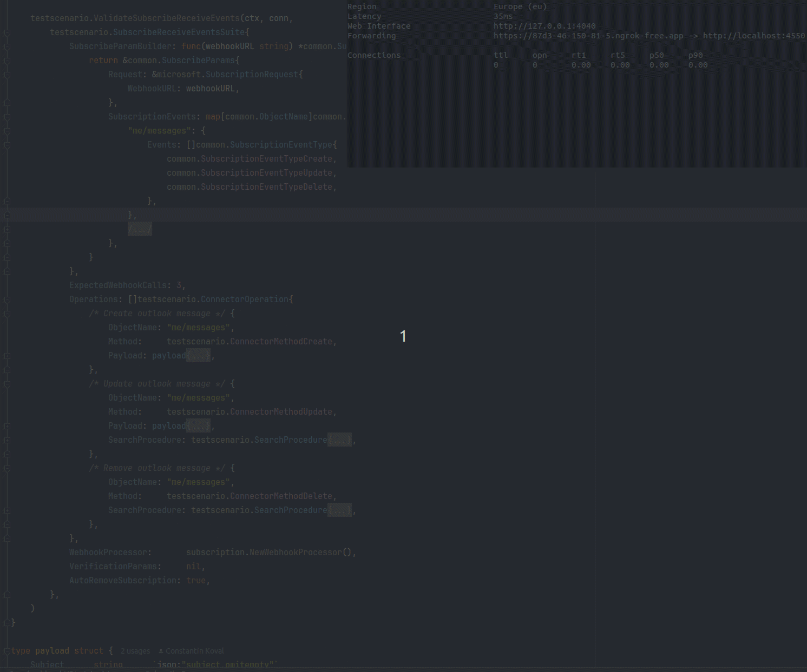

# Live Tests for Webhook & Subscriptions

> Part of [Contributing a Subscribe Action](../../CONTRIBUTING_SUBSCRIBE_ACTION.md).

After implementing the connector interfaces, you should verify them in a real environment against a provider sandbox.
There are "live test" scenarios in the `testscenario` package that automate the tedious setup,
making it easy for any developer to execute them and examine the results.

These tests are designed to be "live" -- they interact with real provider APIs and wait for real webhook events.

## Workflow: Using `ngrok` for Local Development

To see webhooks in action, you need a public endpoint that the provider can reach.

1. **Expose Local Port:** Run `ngrok` to expose your local port `4550` as a public URL:
   ```bash
   ngrok http 4550
   ```
2. **Run the Test Script:** Start your provider-specific test harness (e.g., `test/<provider>/subscription/main.go`).
3. **Provide Public URL:** The script will prompt you for the public URL provided by `ngrok` or a tool of your choice.
4. **Automatic Server:** The test scenario automatically starts a local server on port `4550` as a side effect.
5. **Observe:** The test suite will invoke your connector methods and print results of incoming events directly to your terminal.

## Stage 1: Webhook Verification (`RunWebhookConsumer`)

**Prerequisite:** [PR 2 — Verification](./pr-2-verification.md).

This is the most basic stage. It tests if the connector can correctly verify incoming webhook messages.

### What it does
1. Starts a local webhook server (on port 4550).
2. Asks you for a public URL (e.g., via `ngrok`).
3. Waits for you to manually trigger events (e.g., via the provider's Dashboard or by using `curl` to call the provider's API).
4. When a webhook arrives, it uses your connector's `VerifyWebhookMessage` to validate it.
5. If valid, it prints the event body to the screen. Otherwise, prints an error.

This utility is extremely helpful during initial development to:
- **Define Event Structure:** See the raw JSON payload sent by the provider.
- **Map Object Properties:** Understand how the provider's object names, properties map to Ampersand concepts.
- **Focus on Content:** You don't have to worry about the webhook plumbing; it's available out of the box.

### How to use it
In your provider's test harness (e.g., `test/<provider>/webhook/main.go`):

```go
testscenario.RunWebhookConsumer(ctx,
    &testscenario.WebhookProcessor{},
    conn, // must implement WebhookVerifierConnector
    verificationParams,
)
```

## Stage 2: Automated Subscription & Events (`ValidateSubscribeReceiveEvents`)



**Prerequisite:** [PR 4 — Subscribe](./pr-4-subscribe-update-delete.md).

This stage tests the full loop: creating a subscription, triggering events via the connector itself,
and receiving those events via webhooks. It makes events **reproducible**.

### What it does
1. Starts a local webhook server and asks for a public URL.
2. Invokes `connector.Subscribe()` to create a subscription in the provider.
3. Performs automated operations (Create/Update/Delete records) using the connector's `Write()` and `Delete()` methods.
4. As a side effect of these operations, the provider sends webhook events.
5. The test waits for the expected number of events and prints them to the screen.
6. Finally, it invokes `connector.DeleteSubscription()` to clean up.

When events show up in your terminal after your operations, you know
your `Subscribe`, `Read`, `Write`, `Delete`, and `VerifyWebhookMessage` implementations are working correctly together.

### How to use it
Define a `SubscribeReceiveEventsSuite` and call the validator:

```go
suite := testscenario.SubscribeReceiveEventsSuite{
    ExpectedWebhookCalls: 2,
    Operations: []testscenario.ConnectorOperation{
        {ObjectName: "contact", Method: testscenario.ConnectorMethodCreate, Payload: contactPayload},
        {ObjectName: "contact", Method: testscenario.ConnectorMethodDelete, SearchBy: searchByEmail},
    },
    SubscribeParamBuilder: func(webhookUrl string) *common.SubscribeParams {
        return &common.SubscribeParams{ /* ... */ }
    },
    WebhookProcessor: &testscenario.WebhookProcessor{
        Interceptor: microsoftInterceptor,
    },
    AutoRemoveSubscription: true,
}

testscenario.ValidateSubscribeReceiveEvents(ctx, conn, suite)
```

## Stage 3: Subscription Lifecycle (`SubscriptionCreateUpdateDelete`)

**Prerequisite:** [PR 4 — Subscribe / Update / Delete](./pr-4-subscribe-update-delete.md).

This stage focuses purely on the subscription management methods (`Subscribe`, `UpdateSubscription`, `DeleteSubscription`) without waiting for events.

### What it does
1. **Create:** Invokes `Subscribe` and displays the `SubscriptionResult`.
2. **Update:** Invokes `UpdateSubscription` with new parameters, displays `SubscriptionResult`.
3. **Delete:** Invokes `DeleteSubscription` to ensure the subscription is removed.

This is useful for ensuring that your connector correctly handles the reconciliation of subscription states (e.g., adding/removing objects or event types).
Examine output of `SubscriptionResult` after each stage.

### How to use it
```go
testscenario.SubscriptionCreateUpdateDelete(ctx, conn, createParamsBuilder, updateParamsBuilder)
```

## Custom Webhook Interceptors

Some providers (like Slack or Microsoft) require a "handshake" or "URL verification" when a webhook is first registered.
They send a special request to your endpoint, and your server must respond with a specific value to prove ownership.

### `testscenario.WebhookInterceptorFunc`

You can use an **Interceptor** to handle these special requests.
If the interceptor handles the request (returns `true`),
the test harness will skip the normal verification process for that request.

### Example: Slack URL Verification
Slack sends a `url_verification` event with a `challenge` parameter. You must respond with the same challenge.

```go
var slackInterceptor = testscenario.WebhookInterceptorFunc(
    func(writer http.ResponseWriter, request *http.Request, data []byte) bool {
        // 1. Parse the body to check for a challenge
        body := struct{ Challenge string `json:"challenge"` }{}
        if err := json.Unmarshal(data, &body); err != nil || body.Challenge == "" {
            return false // Not a verification request, let the normal flow handle it
        }

        // 2. Respond to Slack
        writer.WriteHeader(http.StatusOK)
        writer.Header().Set("Content-Type", "text/plain")
        writer.Write([]byte(body.Challenge))

        return true // Request handled
    },
)

// Use it in your WebhookProcessor
processor := &testscenario.WebhookProcessor{
    Interceptor: slackInterceptor,
}
```

## Benefits for Development & Maintenance
- **Easy for Newcomers:** If someone changes the code later, they just need the `<provider>-creds.json` file, `ngrok`, and the script.
- **Zero Setup:** No need to manually handle webhooks for every test run.
- **Repeatable:** Easily run the same scenario multiple times to debug edge cases.
- **Portability:** Anyone with access to a sandbox and credentials can run these scripts without knowing the internal
details of the connector. This is similar to simple operations like `Read`, `Write`, `ListObjectMetadata`.
