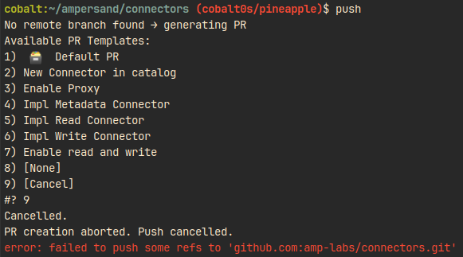
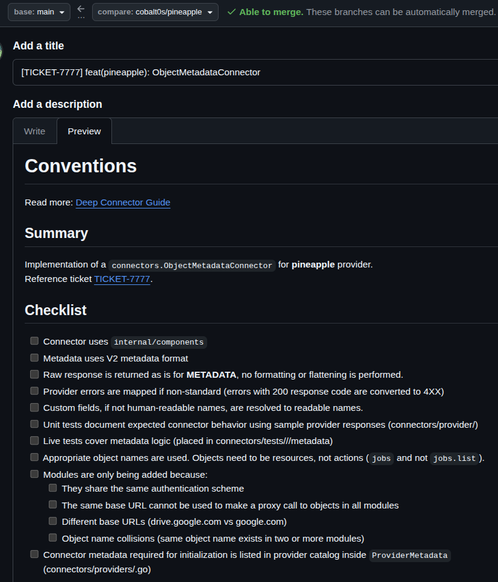
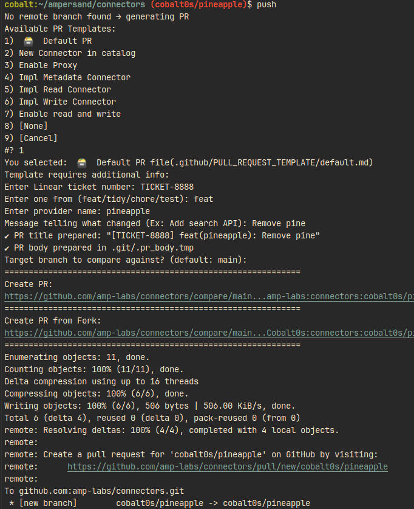
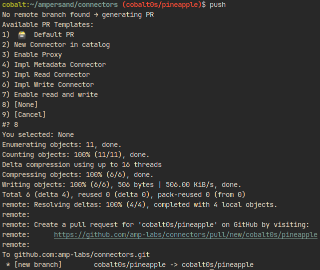

# Overview

This repository contains scripts and [hooks](https://git-scm.com/book/en/v2/Customizing-Git-Git-Hooks)
that enforce a **Pull Request template workflow** for contributors working with Git in this project.

> **Note**: If you are using Graphite (`gt submit`), this hook is not applicable. Only install this hook if you are using Git directly.

The goal is to help contributors automatically fill out PR metadata based on the project's **feature template standards**.

## Notes for Contributors

* Always install the hook if you work directly with Git; it ensures PRs conform to project standards.
* For Graphite users, **do not install this hook**, as Graphite handles PR creation differently.
* All fields prompted in the console are defined in the **templates header**, are mandatory, and use YAML format.
* When a new branch is pushed, the hook prints two URLs:
  * **Direct PR URL** - for creating a PR on the `connectors` repository.
  * **Fork PR URL** - useful if you are working from a **fork**.

# Installing the Git Hook

To enable the automated PR template prompts, run:
```bash
make git-hooks-install
```

This will:
1. Install the pre-push Git hook located in `scripts/git/hooks`.
2. Ensure that every push from a local branch without a remote counterpart triggers the `pr_template_select.sh` script.
3. Prompt you to **select** a PR template and **fill** in the required fields.

> If you ever need to remove the hook (for example, when using Graphite or to disable prompts 😢), run:
```bash
make git-hooks-uninstall
```

# Workflow Example
When you push a new branch that has no remote branch yet, the hook will run:

### Cancel PR template selection
If you press Cancel, the script stops and no PR template is applied:



### Fill in a specific PR template

If you select a feature template (e.g., `Read Connector` or `Metadata Connector`), the script will:
  1. Prompt for required fields defined in the YAML header of the template (e.g., provider name, ticket number).
  2. Automatically build the PR title and body based on your input.
  3. URL-encode and display the GitHub PR URL and fork PR URL which is useful if you are working from the fork.

**Example prompt:**


**Resulting PR in GitHub UI:**

 

### Use the default template

If your change does not fit a well-defined feature, select the `Default PR template`.
You will be prompted to enter a title, but no specialized fields are required:



### Skip PR template (None)

If you select None, no PR template will be applied. The script will exit successfully omitting the hook (not advised):




# Technical Details
* Template location: `.github/PULL_REQUEST_TEMPLATE/*.md`
* Hook script: `scripts/git/hooks/pre-push`
* Template selection script: `scripts/git/pr_template_select.sh`
* Make targets:
  * `make git-hooks-install` → installs the hook
  * `make git-hooks-uninstall` → removes the hook

The **hook** is triggered only on pushes of new branches without a remote. **Once you have a branch in GitHub**, subsequent pushes will not prompt for template selection.

