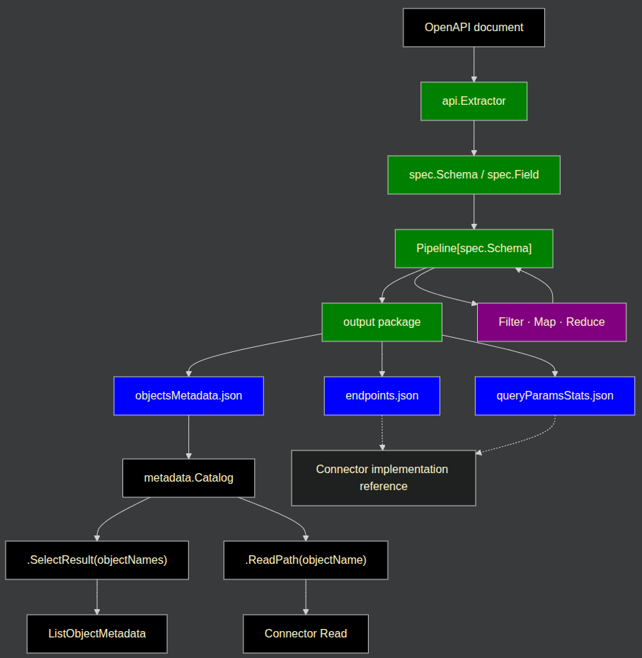

# OpenAPI Connector Discovery

## Overview

The `api` package provides a common way to turn an OpenAPI specification into useful knowledge for connector development.
An OpenAPI document is a valuable source of information, but it is not necessarily a complete or authoritative description of the API.
The purpose of these scripts is to **harvest the information needed to build the connector** and present it in a consistent form.

The overall workflow is therefore:


The key idea is that you are **working with `spec.Schema` and `spec.Field`**.

The package gives connector developers a common vocabulary and reusable transformations
so that provider-specific scripts mostly describe **what they want**,
rather than **how** to loop over and manipulate the data.

---

## The intermediate representation

`api.Extractor` is the entrance to the package. Its extraction methods produce `spec.Schema` values.

A `spec.Schema` represents an API object discovered from the OpenAPI document. It contains information such as:

- object name and display name
- URL path and HTTP operation
- response/list information
- query parameters
- the object's `spec.Fields`
- OpenAPI origin information for investigation or advanced use

A `spec.Field` describes an individual field and contains information such as its name, display name, type, value type, options, references, and OpenAPI origin.

These types are the common intermediate representation used throughout the pipeline.

---

## Extracting schemas

`api.Extractor` produces `spec.Schema` values from OpenAPI operations.
The current extraction helpers focus on schemas that represent **collections**,
most commonly from `GET` operations and, for search endpoints, sometimes from `POST` operations.

The extraction method and its options describe how the collection is represented in the provider's OpenAPI document:

```go
schemas, err := extractor.ExtractListSchemas(
    api.GET,
    api.List.WithMediaType("application/vnd.api+json"),
    api.List.WithArrayLocator(api.ArrayLocationAtData),
    api.List.WithPropertyFlattener(func(objectName, fieldName string) bool {
        return fieldName == "attributes"
    }),
    api.List.WithOnlyOptionalQueryParameters(),
)
```

The `api.List` options determine how the extractor locates the **collection** and its fields:

- `WithMediaType` selects the response representation to inspect. Default is JSON.
- `WithArrayLocator` identifies the array containing the collection items, such as `data` or an object-specific property.
- `WithPropertyFlattener` identifies a nested property whose fields should become fields of the extracted schema.
- `WithOperationFilter` excludes operations that are not suitable for the connector.
- `WithAutoSelectArrayItems` selects the only array when the response shape makes the choice unambiguous.
- `WithOnlyOptionalQueryParameters` excludes operations that require query parameters.

Provider-specific locators and filters are expected when the OpenAPI document uses non-standard or inconsistent response shapes.
The result is a collection of `spec.Schema` values that can be passed directly to a pipeline or processed via a normal loop.

## You can work with the raw schemas

A pipeline is not required.

The most basic form is:

```go
getSchemas, err := extractor.ExtractListSchemas(api.GET)
goutils.MustBeNil(err)

for _, schema := range getSchemas {
    // schema is spec.Schema
}
```

A `Pipeline[spec.Schema]` is simply a convenient way to express transformations over those schemas.
You can always return to a normal loop when a provider has genuinely special processing that is not represented by the common API.

```go
pipe := pipeline.NewSchemaPipe(getSchemas)

for _, schema := range pipe.List() {
    // schema is spec.Schema
}
```

However, **the preferred approach is to stay in the pipeline** and look for an existing operation in the `api` subpackages before writing custom loops.

---

## Think in terms of transformations

Once you have `Pipeline[spec.Schema]`, think about **what you want to do to the collection**.

The main operations have deliberately simple meanings:

| Need                                       | Pipeline operation |
|--------------------------------------------|--------------------|
| **Exclude** or **keep** schemas            | `Filter`           |
| Consolidate or apply **holistic changes**  | `Reduce`           |
| Change values on **schemas** or **fields** | `Map`              |
| **Combine** independent pipelines          | `pipeline.Combine` |

For example:

> "I need to remove endpoints I don't want."

That's a **Filter**.

> "I need to determine each schema's value by looking at the other schemas in the collection."

That's a **Reducer**.

> "I need to change object display names."

That's a **Mapping**.

> "I need to change every field's display name."

That's also a **Mapping**, but applied to `spec.Field` values for each `spec.Schema.Fields`.

> "I need to combine schemas from two sources."

That's a **pipeline.Combine** with `merging` directives.


## Filtering the collection

Use `Filter` to remove schemas that should not be part of the final collection.
The `filters` package provides reusable path matchers and rule-based filtering:

```go
ignoreEndpoints := filters.NewRules("/finance/agreements/count")

pipe = pipe.Filter(filters.KeepWithPath(
    filters.AndPathMatcher{
        filters.NoIdPath{},
        filters.NewDenyPathStrategy(ignoreEndpoints),
    },
))

output.PrintUnusedRules("ignoreEndpoints", ignoreEndpoints)
```

`NoIdPath` removes schemas whose paths contain ID parameters such as `{id}`.
This leaves schemas that represent collection endpoints. Provider-specific exclusions can be added through
a rule set such as `ignoreEndpoints`. These may be endpoints that are not actually collections or collections that
cannot be supported by the connector's Read implementation.

When adding a provider-specific exclusion, **leave a comment explaining** why it is necessary so that future 
developers have the context to reconsider it.

Rules support `*` as a prefix or suffix wildcard.

`output.PrintUnusedRules` reports rules that did not match any schema, including unused wildcard rules.
**Unused rules must be removed**, keeping the extraction script aligned with the current OpenAPI document.

---

## Reducing the collection

Use `Reduce` when a transformation needs to consider the collection as a whole.
A common example is assigning object names from the available URLs:

```go
pipe = pipe.
    Reduce(reducers.ShortestNameFromUrlWithFullFallback)
```

The `reducers` package contains reusable collection-wide algorithms, for example:

```go
Reduce(reducers.ShortestNameFromUrl)
Reduce(reducers.SortByObjectName)
```

Reducers are useful when the result for **one schema depends on the other schemas** available in the collection.

---

## Mapping schemas and fields

Use `Map` for transformations of individual `spec.Schema` or `spec.Field` values.
Common schema mappings include:

```go
pipe = pipe.
    Map(mapping.ObjectNameFromUrlPath).
    Map(mapping.DisplayNameFormat(
        mapping.SlashesToSpaceSeparated,
        mapping.CamelCaseToSpaceSeparated,
        mapping.CapitalizeFirstLetterEveryWord,
    )).
    Map(mapping.DisplayNameOverride(displayNameOverride))
```

Fields can be transformed with `mapping.Fields`:

```go
pipe = pipe.Map(
    mapping.Fields(
        mappingfields.DisplayNameFormat(formatFieldDisplayName),
    ),
)
```

`mapping.Fields` applies `pipeline.MapFunc[spec.Field]` transformations to every field.
The script therefore describes the nested transformation on `spec.Schema.Fields`.

---

## Combining pipelines

Use `pipeline.Combine` when schemas come from independent pipelines and need to be brought together.

```go
allObjectsPipe := pipeline.Combine(
    listPipeline,
    searchPipeline,
    merging.CombineByObjectName,
    merging.ChooseRight,
)
```

The `merging` package provides reusable strategies for matching and choosing between schemas.
A common case is choosing between GET and POST representations of the same object.

---

## Prefer the common API

Before writing custom processing, check the `filters`, `reducers`, `merging`, and `mapping` packages.
Common transformations belong in the library so connector scripts can express intent consistently.
If no existing operation fits a genuinely provider-specific case,
it is fine to work with the raw schemas and use a normal loop.

---

## Producing the standard output

The final pipeline is passed to the `output` package:

```go
goutils.MustBeNil(output.WriteMetadata(files.OutputDir, pipe))
goutils.MustBeNil(output.WriteQueryParamStats(files.OutputDir, pipe))
goutils.MustBeNil(output.WriteEndpoints(files.OutputDir, &pipe, nil, nil, nil))
```

For very large metadata output you may want to produce `objectsMetadata.json.gz`:
```go
goutils.MustBeNil(output.WriteZippedMetadata(files.OutputDir, pipe))
```

The standard artifacts are:

- **`objectsMetadata.json`** or **`objectsMetadata.json.gz`** — object and field metadata used by `ListObjectMetadata`, including the original object path.
- **`endpoints.json`** — a compact summary of endpoint information relevant to connector implementation, such as the URL path, HTTP operation, and response field.

For example:
```json
{
  "accounts": {
    "read": {
      "url": "/api/accounts",
      "operation": "GET",
      "responseKey": "data"
    }
  }
}
```

`endpoints.json` is still evolving. It currently focuses on Read, 
but may later include information for Write, Delete, Subscribe, and other operations. 
`queryParamsStats.json` complements it with more detailed query-parameter information.

These artifacts are a skimmed, connector-focused view of the OpenAPI document, not runtime connector configuration.

---

## Adding provider-specific output

Standard output covers information common to connectors, but a script can generate additional artifacts
when provider-specific information is useful to its implementation.
For example, Stripe generates `expandableFields.json` from the `x-expandableFields` OpenAPI extension. 
The Stripe connector uses this artifact during implementation.

Keep common information in the standard output and add separate artifacts for genuinely provider-specific knowledge.

---

## Tracking configuration

Rules and registries can also provide feedback about the extraction script.

For example:

```go
ignoreEndpoints := filters.NewRules(...)
displayNameOverride := core.NewTrackedMap(...)
```

After the pipeline runs, output helpers can report unused rules or redundant mappings:

```go
output.PrintUnusedRules("ignoreEndpoints", ignoreEndpoints)
output.PrintRedundantKeys("displayNameOverride", displayNameOverride)
```

This keeps configuration aligned with the OpenAPI document. If the document changes, the script can reveal rules
that no longer have an effect instead of leaving stale configuration behind.
