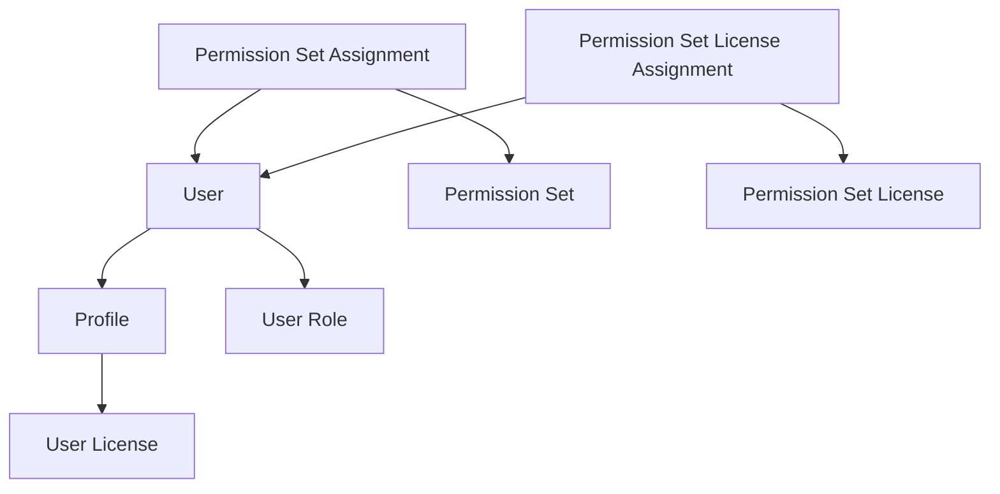

```mermaid
graph TD
    UserLicense["User License"]
    Profile["Profile"]
    UserRole["User Role"]
    User["User"]
    PS["Permission Set"]
    PSL["Permission Set License"]
    PSA["Permission Set Assignment"]
    PSLA["Permission Set License Assignment"]

    Profile --> UserLicense
    User --> Profile
    User --> UserRole

    PSA --> PS
    PSA --> User
    PSLA --> PSL
    PSLA --> User
```